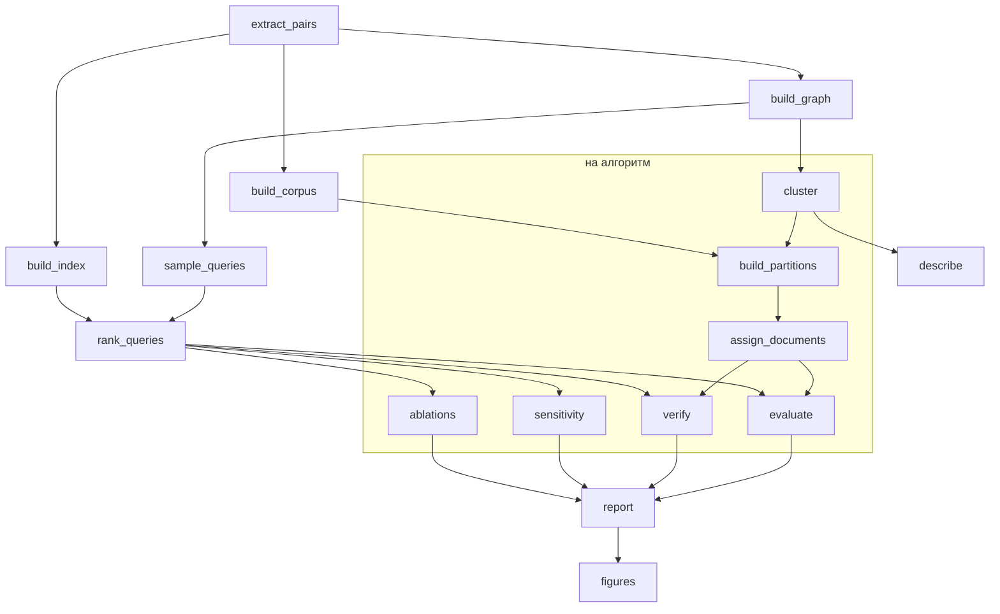

# sharded-semantic-index

[](https://github.com/pstpn/sharded-semantic-index/actions/workflows/ci.yml)

Семантическое шардирование инвертированного индекса по словам: слова, которые встречаются в
одних запросах, кладутся в один шард, чтобы запрос опрашивал меньше шардов. Репозиторий
содержит библиотеку, воспроизводимый конвейер эксперимента на MS MARCO v2.1 и его результаты.

Эксперимент сравнивает семантическое разбиение со случайным (по хешу слова) при равном числе
шардов: четыре алгоритма кластеризации, десять стратегий разбиения, семь выборок запросов.

## Содержание

- [Идея](#идея)
- [Конвейер](#конвейер)
- [Что сравнивается](#что-сравнивается)
- [Что измеряется](#что-измеряется)
- [Быстрый старт](#быстрый-старт)
- [Настройка](#настройка)
- [Результаты](#результаты)
- [Воспроизводимость](#воспроизводимость)
- [Структура репозитория](#структура-репозитория)
- [Разработка](#разработка)
- [Данные и литература](#данные-и-литература)

Подробная документация:

| Документ | Содержание |
|---|---|
| [docs/method.md](docs/method.md) | метод и протокол оценки: что считает каждая стадия |
| [docs/configuration.md](docs/configuration.md) | справочник параметров `params.yaml` |
| [docs/outputs.md](docs/outputs.md) | справочник выходных файлов: таблицы, столбцы, графики |

## Идея

1. По журналу запросов строится граф: вершины — слова, ребро соединяет слова, которые
   встречаются в одних запросах; вес ребра — NPMI.
2. Слова графа делятся на кластеры. Кластер становится шардом.
3. Документ хранится во всех шардах своих слов, поэтому опрос всех шардов запроса возвращает
   то же, что полный индекс. Плата — дублирование документов.
4. Запрос отправляется в шарды своих слов, начиная с шарда самых редких слов. Если опросить
   только первые несколько шардов, часть выдачи теряется; насколько — и есть предмет измерения.

Случайное разбиение раскладывает слова запроса по разным шардам. Семантическое собирает их
вместе, но создаёт шарды очень разного размера; стратегия с бюджетом объёма ограничивает размер
шарда сверху.

## Конвейер

Конвейер описан в [`dvc.yaml`](dvc.yaml). Стадии, отмеченные «на алгоритм», выполняются отдельно
для каждого алгоритма из `clustering.methods` (`cluster@leiden`, `cluster@cpm`, …).



Стрелки показывают основной поток данных. Полный граф зависимостей со всеми стадиями печатает
`dvc dag`.

| Стадия | Что делает | Результат |
|---|---|---|
| `extract_pairs` | читает MS MARCO, оставляет по два пассажа на запрос | `data/processed/pairs.parquet` |
| `build_corpus` | один раз разбирает документы на слова | `data/interim/corpus/` |
| `build_index` | строит полный индекс Whoosh — эталон | `data/interim/index/` |
| `build_graph` | строит граф слов по обучающим запросам | `models/graph.parquet` |
| `sample_queries` | формирует выборки запросов | `data/interim/queries.parquet` |
| `rank_queries` | сохраняет выдачу полного индекса по каждому запросу | `data/interim/rankings/` |
| `cluster` | делит слова графа на кластеры (на алгоритм) | `models/clusterings/` |
| `build_partitions` | строит стратегии «слово → шарды» (на алгоритм) | `models/partitions/` |
| `assign_documents` | раскладывает документы по шардам (на алгоритм) | `data/interim/assignments/` |
| `evaluate` | измеряет каждый запрос каждой выборки (на алгоритм) | `data/interim/evaluation/` |
| `verify` | проверяет полноту и сверяет расчёт с настоящими индексами шардов (на алгоритм) | `data/interim/verification/` |
| `sensitivity` | проверяет устойчивость к зерну, параметру алгоритма и объёму журнала (на алгоритм) | `data/interim/sensitivity/` |
| `ablations` | измеряет варианты с одной изменённой настройкой (на алгоритм) | `data/interim/ablations/` |
| `report` | сводит измерения в таблицы с доверительными интервалами | `metrics/*.csv` |
| `describe` | описывает корпус, граф и кластеры | `metrics/corpus.json` и три таблицы |
| `figures` | рисует графики | `reports/figures/` |

## Что сравнивается

**Алгоритмы кластеризации** (`clustering.methods`): Leiden, Leiden с функцией качества CPM,
Infomap, METIS.

**Стратегии** (`partition.strategies`) — как из кластеров получаются шарды:

| Стратегия | Правило «слово → шард» |
|---|---|
| `base` | слово графа — в шард своего кластера; слово вне графа — по хешу в отдельные шарды |
| `aff` | слово вне графа присоединяется к кластеру, с которым встречается в документах |
| `bal` | `aff` под бюджетом объёма: крупные кластеры дробятся, части упаковываются в шарды не больше заданной доли корпуса |
| `base_r2`, `base_r3`, `aff_r2`, `aff_r3` | слово графа дополнительно кладётся в 1–2 ближайших чужих кластера |
| `hash_base`, `hash_aff`, `hash_bal` | случайное разбиение по хешу слова на столько же шардов, сколько у `base`, `aff`, `bal` |

**Выборки запросов:**

| Выборка | Состав |
|---|---|
| `train` | запросы, по которым строился граф |
| `holdout` | отложенные запросы того же источника — основная выборка |
| `ood` | запросы другого набора данных (Natural Questions) |
| `connected_pairs`, `connected_triples` | пары и тройки слов графа, встречающихся почти только вместе |
| `frequent_pairs`, `frequent_triples` | пары и тройки слов графа, чаще всего встречающихся вместе |

## Что измеряется

Эталон — выдача BM25 полного индекса. Для каждого запроса и каждого бюджета `b` (опрошены
первые `b` шардов покрытия, либо всё покрытие):

| Метрика | Смысл |
|---|---|
| `overlap` | доля первых 10 документов полного индекса, найденная в опрошенных шардах |
| `volume` | доля корпуса, которую пришлось просмотреть в опрошенных шардах |
| `fanout` | сколько шардов нужно, чтобы покрыть все слова запроса |
| `duplication` | в скольких шардах в среднем хранится документ |
| `largest_shard` | доля корпуса в самом крупном шарде |

Средние приводятся с 95%-ми доверительными интервалами (бутстреп по запросам). Сравнения
«стратегия против hash», «стратегия против стратегии» и «алгоритм против алгоритма» считаются
как парные разности на одних и тех же запросах.

Индексы шардов для оценки не строятся: выдача шардов вычисляется из выдачи полного индекса.
Стадия `verify` для каждой стратегии проверяет, что это вычисление точное, в том числе на
настоящих индексах шардов; при любом расхождении конвейер останавливается.

## Быстрый старт

Нужны Python 3.11+ и несколько гигабайт на диске.

```bash
make setup    # окружение .venv с зафиксированными версиями зависимостей
```

```bash
make repro    # весь эксперимент: dvc repro
```

```bash
make results  # сводная таблица результатов на выборке holdout
```

```bash
make check    # линтер, проверка типов и тесты
```

Первый запуск скачивает MS MARCO и Natural Questions с HuggingFace. Полный прогон занимает
несколько часов; повторный пересчитывает только стадии, входы которых изменились. Прерванный
прогон продолжается с последней завершённой стадии.

Одну стадию можно запустить отдельно:

```bash
.venv/bin/dvc repro evaluate@leiden
```

## Настройка

Все параметры эксперимента находятся в [`params.yaml`](params.yaml), значений по умолчанию в
коде нет. Конфиг проверяется при запуске любой стадии: опечатка в имени параметра или
недопустимое значение останавливают запуск с объяснением.

Добавить алгоритм, стратегию или вариант абляции можно одной строкой конфига:

```yaml
clustering:
  methods:
    leiden_fine: {algorithm: leiden, resolution: 5.0, iterations: convergence, max_iterations: 200}   # стадии *@leiden_fine

ablations:
  variants:
    min_npmi_05: {graph: {min_npmi: 0.5}}               # что изменить относительно основного конфига
```

Полное описание параметров и допустимых значений — в
[docs/configuration.md](docs/configuration.md).

## Результаты

Результаты последнего прогона хранятся в git:

| Файл | Содержание |
|---|---|
| `metrics/partitions.csv` | число шардов, дублирование и баланс каждого разбиения |
| `metrics/routing.csv` | сколько шардов нужно запросу, по выборкам |
| `metrics/retrieval.csv` | overlap и объём опроса при каждом бюджете, по выборкам |
| `metrics/comparisons.csv` | парные разности с доверительными интервалами |
| `metrics/slices.csv` | отложенные запросы по связности слов и по длине запроса |
| `metrics/sensitivity.csv` | устойчивость к зерну, параметру алгоритма и объёму журнала |
| `metrics/ablations.csv` | варианты с одной изменённой настройкой |
| `metrics/verification.csv` | результаты проверок корректности |
| `metrics/corpus.json`, `clusterings.csv`, `clusters.csv`, `frame_words.csv` | описание корпуса, графа и кластеров |
| `reports/figures/` | графики в стиле SciencePlots: обзорные `overview_*.pdf` по всем алгоритмам, стратегиям и выборкам сразу и по каталогу на алгоритм; язык подписей — `figures.language` |

Каждая таблица устроена одинаково: строка — конфигурация (`method`, `strategy`, `sample`),
столбцы — метрики. Описание всех столбцов — в [docs/outputs.md](docs/outputs.md).

```python
import pandas as pd

retrieval = pd.read_csv("metrics/retrieval.csv", dtype={"budget": str})
table = retrieval.query("sample == 'holdout' and budget == '1'").pivot(
    index="strategy", columns="method", values="overlap"
)
print(table.to_latex(float_format="%.3f"))
```

## Воспроизводимость

- **Версии.** Прямые зависимости перечислены в `pyproject.toml`, точные версии окружения — в
  `requirements.lock`.
- **Параметры.** Всё, что влияет на результат, задано в `params.yaml`; DVC записывает в
  `dvc.lock` значения параметров и хеши входов и выходов каждой стадии.
- **Код.** Каждая стадия объявляет в `dvc.yaml` все модули пакета, которые импортирует её точка
  входа (кроме обвязки — `config.py`, `paths.py`, `pipeline/common.py`, которые только читают
  настройки и пути), поэтому правка модуля пересчитывает ровно те стадии, чьи результаты от
  него зависят. Соответствие списков коду проверяет `tests/test_dvc.py`.
- **Случайность.** Зёрна выборок, кластеризации, бутстрепа и рисунков заданы в конфиге.
- **Побайтная стабильность.** Повторный запуск стадии на тех же входах даёт те же файлы байт в
  байт, поэтому DVC не пересчитывает зависимые стадии без причины. Это проверяется тестами.
- **Дорогие артефакты.** Полный индекс пересобирается только при изменении корпуса или
  стоп-листа; выдача полного индекса переиспользуется по каждому запросу.
- **Проверки.** Стадия `verify` и тесты закрепляют инварианты: полноту покрытия, равенство
  расчётной и настоящей выдачи шардов, равное число шардов у стратегии и её hash-разбиения.

## Структура репозитория

```
├── params.yaml            все параметры эксперимента
├── dvc.yaml               стадии конвейера и их зависимости
├── dvc.lock               состояние последнего прогона
├── Makefile               команды: setup, repro, results, check, …
├── pyproject.toml         зависимости и настройки ruff, mypy, pytest
├── requirements.lock      точные версии окружения
│
├── sharded_index/         пакет
│   ├── config.py          схема и проверка params.yaml
│   ├── paths.py           расположение артефактов
│   ├── text.py            нормализация текста и разбор на слова
│   ├── storage.py         побайтно стабильное сохранение массивов
│   ├── routing.py         покрытие запроса шардами
│   ├── data/              MS MARCO, корпус, выборки запросов
│   ├── graph/             граф слов и алгоритмы кластеризации
│   ├── partition/         разбиение: модель, hash, голосование, бюджет, реплики, стратегии
│   ├── index/             индексы Whoosh, BM25 по статистике коллекции, эталонная выдача
│   ├── evaluation/        измерения, статистика, срезы, варианты, проверки
│   ├── reporting/         таблицы, описание данных, графики
│   └── pipeline/          стадии: python -m sharded_index.pipeline.<стадия>
│
├── tests/                 тесты, включая прогон всего конвейера на синтетических данных
├── docs/                  метод, справочники параметров и выходных файлов
├── metrics/               таблицы результатов (в git)
├── reports/               figures/ — графики (в git); отчёты и статья
├── references/            данные и литература
├── models/                граф, кластеры, разбиения (кэш DVC)
└── data/                  исходные и промежуточные данные (кэш DVC)
```

## Разработка

```bash
make hooks      # установить pre-commit: ruff, mypy и базовые проверки при каждом коммите
```

| Команда | Что делает |
|---|---|
| `make lint` | ruff: стиль и типичные ошибки |
| `make format` | ruff: форматирование и автоисправления |
| `make typecheck` | mypy |
| `make test` | pytest |
| `make check` | всё перечисленное |

Те же проверки выполняет GitHub Actions на каждый push и pull request.

Тесты не требуют сети и данных: они строят небольшой синтетический корпус, проверяют на нём
каждую часть библиотеки и прогоняют весь конвейер от корпуса до графиков. Два теста следят за
документацией: каждый параметр конфига должен быть описан в `docs/configuration.md`, каждый
столбец каждой таблицы — в `docs/outputs.md`.

Стадии можно запускать на других данных, не трогая репозиторий: переменная `SSI_ROOT` задаёт
каталог артефактов, `SSI_PARAMS` — файл параметров.

## Данные и литература

- [MS MARCO v2.1](https://huggingface.co/datasets/microsoft/ms_marco) — запросы и пассажи.
- [Natural Questions (open)](https://huggingface.co/datasets/google-research-datasets/nq_open) —
  запросы другого источника для выборки `ood`.
- Список литературы — в [references/README.md](references/README.md).
